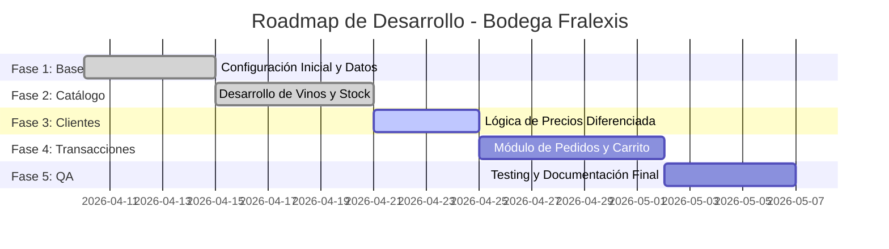

# Plan de Gestión del Proyecto: Bodega Fralexis E-commerce

**Versión:** 1.2.0  
**Fecha de Creación:** 22 de abril de 2026  
**Estado:** En Desarrollo (Fase de Transacciones)

---

## 1. Resumen Ejecutivo
El proyecto "Bodega Fralexis" consiste en el desarrollo de una plataforma de gestión de ventas de vinos bajo el paradigma de Programación Orientada a Objetos (POO). El sistema implementa una arquitectura de capas (Controller-Service-Repository) para garantizar escalabilidad y mantenimiento, permitiendo la gestión diferenciada de clientes minoristas y mayoristas.

---

## 2. Alcance del Proyecto (Scope)
El sistema debe cumplir con las siguientes funcionalidades críticas:
*   **Gestión de Catálogo:** CRUD completo de vinos con atributos técnicos (uva, cosecha, tipo).
*   **Gestión de Clientes:** Clasificación por tipo (Minorista/Mayorista) con lógica de precios dinámica.
*   **Control de Inventario:** Descuento de stock en tiempo real tras confirmación de pedidos.
*   **Sistema de Pedidos:** Consolidación de ítems, cálculo de totales e impuestos.

---

## 3. Estructura de Desglose del Trabajo (WBS / EDT)

### Módulo 1: Infraestructura y Núcleo (Core)
| Tarea | Descripción | Responsable | Duración Est. |
| :--- | :--- | :--- | :--- |
| 1.1 | Diseño de Arquitectura de Capas | Arquitecto de SW | 3 días |
| 1.2 | Implementación de `JsonRepository` (Genérico) | Dev Backend | 2 días |
| 1.3 | Configuración de Entorno Node.js/Express | Dev Backend | 1 día |

### Módulo 2: Gestión de Catálogo (Vinos)
| Tarea | Descripción | Responsable | Duración Est. |
| :--- | :--- | :--- | :--- |
| 2.1 | Modelado de Clase `Producto` y `Vino` (Herencia) | Dev Backend | 2 días |
| 2.2 | Lógica de Negocio en `VinoService` (Filtros/CRUD) | Dev Backend | 3 días |
| 2.3 | Exposición de API REST (Rutas/Controllers) | Dev Backend | 2 días |

### Módulo 3: Gestión de Clientes (CRM)
| Tarea | Descripción | Responsable | Duración Est. |
| :--- | :--- | :--- | :--- |
| 3.1 | Implementación de Clientes Mayoristas vs Minoristas | Lider Técnico | 2 días |
| 3.2 | Lógica de Validación de Datos (CUIT/Emails) | QA / Dev | 2 días |

### Módulo 4: Transacciones y Ventas (En Curso)
| Tarea | Descripción | Responsable | Duración Est. |
| :--- | :--- | :--- | :--- |
| 4.1 | Implementación de Clase `Pedido` y `Carrito` | Dev Backend | 3 días |
| 4.2 | Integración de Stock: Descuento automático | Dev Backend | 2 días |
| 4.3 | Generación de Reportes de Venta | Dev Backend | 2 días |

---

## 4. Cronograma (Diagrama de Gantt)

---

## 5. Roles y Responsabilidades (Matriz RACI)

| Actividad | PM | Dev Backend | Lider Técnico | QA |
| :--- | :---: | :---: | :---: | :---: |
| Definición de Requisitos | R | C | A | I |
| Desarrollo de Lógica POO | I | R | A | C |
| Pruebas de Integración | C | C | I | R |
| Documentación Técnica | A | R | I | I |

*R: Responsible, A: Accountable, C: Consulted, I: Informed.*

---

## 6. Gestión de Riesgos

| Riesgo | Impacto | Mitigación |
| :--- | :--- | :--- |
| Inconsistencia en archivos JSON | Alto | Implementar bloqueos de escritura (locks) o copias de seguridad automáticas. |
| Ambigüedad en precios mayoristas | Medio | Definir reglas de negocio claras en la clase `ClienteMayorista`. |
| Falta de escalabilidad | Bajo | Mantener el desacoplamiento mediante el patrón Inyección de Dependencias. |

---

## 7. Estrategia de Calidad (Testing)
1.  **Unit Tests:** Verificación de métodos de cálculo en `Pedido` y `VinoService`.
2.  **Integration Tests:** Pruebas de persistencia sobre los archivos `.json`.
3.  **API Testing:** Validación de códigos de respuesta HTTP (200, 201, 400, 404) mediante herramientas como Postman o Insomnia.
